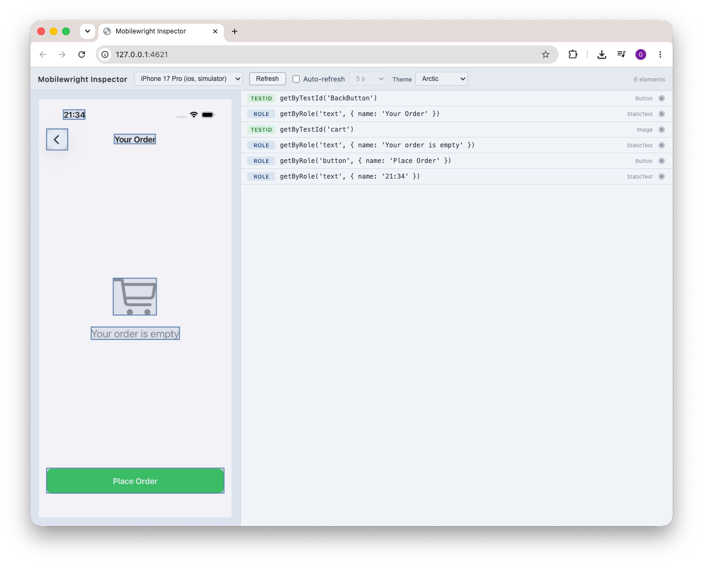

# Mobilewright

[](https://www.npmjs.com/package/mobilewright)
[](LICENSE)
[](https://www.typescriptlang.org/)

Framework for mobile device automation, inspired by Playwright's architecture and developer experience. 

**Mobilewright** targets iOS and Android devices, simulators, and emulators through a clean, auto-waiting API built on top of [mobilecli](https://github.com/mobile-next/mobilecli).

[Get Started](#quick-start) · [API Docs](#api-reference) · [Roadmap](ROADMAP.md) · [Mobile Next Cloud](https://mobilenext.ai)

## Why Mobilewright?

If you've used Playwright, you already know Mobilewright.

| | Mobilewright | Appium | Detox | XCTest/Espresso |
|---|---|---|---|---|
| API style | Playwright (`getByRole`, `expect`) | Selenium (WebDriver) | Custom | Native framework |
| Auto-wait | Built-in, every action | Manual waits | Partial | Manual |
| Setup | `npm install mobilewright` | Server + drivers + caps | React Native only | Xcode/AS only |
| Cross-platform | iOS + Android, one API | Yes, verbose | React Native only | Single platform |
| AI agent support | First-class (accessibility tree) | Limited | No | No |
| Real devices in the cloud | Via [Mobile Next Cloud](https://mobilenext.ai) | Yes (complex) | Simulators only | Yes |
| Locators | Semantic roles + labels | XPath, CSS, ID | Test IDs | Native queries |

## Built for AI agents

Your agent needs a phone, not a screenshot.

Mobilewright exposes the device's accessibility tree — deterministic, token-efficient, no vision model needed. Use it with [mobile-mcp](https://github.com/mobile-next/mobile-mcp), Claude, Cursor, or any coding agent.

```typescript
// An AI agent can control a real phone with readable, semantic actions
await screen.getByRole('button', { name: 'Sign In' }).tap();
await screen.getByLabel('Email').fill('user@example.com');
await expect(screen.getByText('Welcome')).toBeVisible();
```

No XPath. No coordinates. No vision model. The agent reads the accessibility tree and acts on it directly.

## Features

- **Playwright-style API** — `screen.getByRole('button').tap()`, just like `page.getByRole('button').click()`
- **Zero config** — auto-discovers booted simulators
- **Cross-platform** — unified interface for iOS and Android
- **Auto-waiting** — actions wait for elements to be visible, enabled, and stable before interacting
- **Chainable locators** — `screen.getByType('Cell').getByLabel('Item 1')`
- **Retry assertions** — `expect(locator).toBeVisible()` polls until satisfied or timeout
- **Remote support** — connect to mobilecli on another machine for device lab setups
- **Test fixtures** — `@mobilewright/test` extends Playwright Test with `screen` and `device` fixtures

## Quick Start

```bash
npm install mobilewright
```

```typescript
import { ios, expect } from 'mobilewright';

const device = await ios.launch({ bundleId: 'com.example.myapp' });
const { screen } = device;

await screen.getByLabel('Email').fill('user@example.com');
await screen.getByLabel('Password').fill('password123');
await screen.getByRole('button', { name: 'Sign In' }).tap();

await expect(screen.getByText('Welcome back')).toBeVisible();
const screenshot = await screen.screenshot();

await device.close();
```

## Prerequisites

- Node.js >= 18
- A booted iOS simulator, Android emulator, or connected real device

Run `mobilewright doctor` to verify your environment is ready:

```bash
npx mobilewright doctor
```

It checks Xcode, Android SDK, simulators, ADB, and other dependencies — and tells you exactly what's missing and how to fix it. Add `--json` for machine-readable output.

## Packages

| Package | Description |
|---|---|
| `mobilewright` | Main entry point — `ios`, `android` launchers, `expect`, config, CLI |
| `@mobilewright/test` | Test fixtures |
| `@mobilewright/protocol` | TypeScript interfaces (`MobilewrightDriver`, `ViewNode`) |
| `@mobilewright/driver-mobilecli` | WebSocket JSON-RPC client for mobilecli |
| `@mobilewright/driver-mobilenext` | WebSocket JSON-RPC client for [Mobile Next Cloud](https://mobilenext.ai) cloud devices |
| `@mobilewright/core` | `Device`, `Screen`, `Locator`, `expect` — the user-facing API |

Most users only need `mobilewright` (or `@mobilewright/test` for Playwright Test integration).

## API Reference

### Launchers — `ios` and `android`

The top-level entry points. Like Playwright's `chromium` / `firefox` / `webkit`.

```typescript
import { ios, android } from 'mobilewright';

// Launch with auto-discovery (finds first booted simulator)
const device = await ios.launch();

// Launch a specific app
const device = await ios.launch({ bundleId: 'com.example.app' });

// Target a specific simulator by name
const device = await ios.launch({ deviceName: /My.*iPhone/ });

// Explicit device UDID (skips discovery)
const device = await ios.launch({ deviceId: '5A5FCFCA-...' });

// List available devices
const devices = await ios.devices();
const devices = await android.devices();
```

`launch()` handles the full lifecycle:
1. Checks if mobilecli is reachable (auto-starts it for local URLs if not running)
2. Discovers booted devices (picks the first device that matches your criteria)
3. Connects and optionally launches the app
4. On `device.close()`, kills the auto-started server

### Screen

Entry point for finding and interacting with elements. Access via `device.screen`.

**Locator factories:**

```typescript
screen.getByLabel('Email')                          // accessibility label
screen.getByTestId('login-button')                  // accessibility identifier
screen.getByText('Welcome')                         // visible text (exact match)
screen.getByText(/welcome/i)                        // RegExp match
screen.getByText('welcome', { exact: false })       // substring match
screen.getByType('TextField')                       // element type
screen.getByRole('button', { name: 'Sign In' })     // semantic role + name filter
screen.getByPlaceholder('Search...')                // placeholder text
```

**Direct actions:**

```typescript
await screen.screenshot()                            // capture PNG
await screen.screenshot({ format: 'jpeg', quality: 80 })
await screen.swipe('up')
await screen.swipe('down', { distance: 300, duration: 500 })
await screen.pressButton('HOME')
await screen.tap(195, 400)                           // raw coordinate tap
await screen.doubleTap(195, 400)                     // raw coordinate double-tap
await screen.longPress(195, 400, 1000)               // raw coordinate long-press (optional duration in ms)
const tree = await screen.viewTree()                 // raw accessibility tree (ViewNode[])
```

### Locator

Lazy, chainable element reference. No queries execute until you call an action or assertion.

**Actions** (all auto-wait for the element to be visible, enabled, and have stable bounds):

```typescript
await locator.tap()
await locator.doubleTap()
await locator.longPress({ duration: 1000 })
await locator.fill('hello@example.com')              // tap to focus, clear, then type text
await locator.clear()                                // tap to focus + clear the field
await locator.swipe({ direction: 'left' })           // swipe on a specific element
await locator.scrollIntoViewIfNeeded()               // scroll until element is visible
await locator.screenshot()                           // capture just this element (cropped PNG)
```

**Narrowing & combining** — refine a locator that matches multiple elements:

```typescript
locator.filter({ hasText: 'In stock' })              // keep matches whose subtree contains text
locator.filter({ hasNotText: /sold out/i })          // keep matches whose subtree does NOT contain text
locator.filter({ has: screen.getByRole('button') })  // keep matches containing a child locator
locator.filter({ hasNot: screen.getByText('Ad') })   // keep matches NOT containing a child locator
locator.and(screen.getByRole('button'))              // match both this and another locator
locator.or(screen.getByText('Retry'))                // match either this or another locator
```

**Multiple matches** — work with locators that resolve to more than one element:

```typescript
locator.first()                                      // first match
locator.last()                                       // last match
locator.nth(2)                                       // match at index (negative counts from the end)
await locator.count()                                // number of matching elements
await locator.all()                                  // array of Locators, one per match
```

**Queries:**

```typescript
await locator.exists()                               // boolean — present in the hierarchy (no wait)
await locator.isVisible()                            // boolean
await locator.isEnabled()                            // boolean
await locator.isSelected()                           // boolean
await locator.isFocused()                            // boolean
await locator.isChecked()                            // boolean
await locator.getText()                              // waits for visibility first
await locator.getValue()                             // raw value (e.g. text field content)
await locator.boundingBox()                          // { x, y, width, height }
```

**Explicit waiting:**

```typescript
await locator.waitFor({ state: 'visible' })
await locator.waitFor({ state: 'hidden' })
await locator.waitFor({ state: 'enabled' })
await locator.waitFor({ state: 'disabled', timeout: 10_000 })
```

**Chaining** — scope queries within a parent element's bounds:

```typescript
// Tap the delete button inside the first row
const row = screen.getByType('Cell');
await row.getByRole('button', { name: 'Delete' }).tap();

// Get text from a navigation bar
const title = await screen.getByType('NavigationBar').getByType('StaticText').getText();
```

When chaining, child lookups use bounds-based containment: any element whose bounds fit within the parent's bounds is considered a child. This works correctly with mobilecli's flat element lists.

### WebView (hybrid apps)

Apps that embed web content — Cordova, Capacitor, Ionic, or a raw `WKWebView` / Android `WebView` — expose a real DOM behind the native view. `screen.getByWebView()` bridges into that DOM and hands you a **Playwright-compatible** `Page`, so web content is driven with the exact Playwright API you already know.

```typescript
// Find the web view and resolve its page (Playwright-style)
const webview = screen.getByWebView();               // optionally { testId: 'checkout-web' }
const page = await webview.page();

// From here it's the standard Playwright Page / Locator API
await page.goto('https://example.com/login');
await page.getByLabel('Email').fill('user@example.com');
await page.getByRole('button', { name: 'Sign In' }).click();

await expect(page).toHaveURL(/dashboard/);
await expect(page.getByText('Welcome')).toBeVisible();
```

**Page** — navigation and lifecycle: `goto`, `reload`, `goBack`, `goForward`, `url`, `title`, `content`, `waitForURL`, `waitForLoadState`, `close`. Locator factories: `locator`, `getByRole`, `getByText`, `getByLabel`, `getByPlaceholder`, `getByTestId`, `getByAltText`, `getByTitle`.

**Web Locator** — actions: `click`, `fill`, `type`, `press`, `focus`, `hover`, `scrollIntoViewIfNeeded`. Queries: `getText`, `getValue`, `textContent`, `innerText`, `innerHTML`, `inputValue`, `getAttribute`, `boundingBox`, `isVisible`, `isHidden`, `isEnabled`, `isDisabled`, `isChecked`. Plus `waitFor`, `first`/`last`/`nth`, `count`, and `all`. Assertions (`expect`) work the same as on native locators.

`MobileWebViewPage` and `MobileWebViewLocator` are exported from `mobilewright` for advanced use (`Page` / `WebLocator` remain as back-compat aliases).

### Device

Manages the connection lifecycle and exposes device/app-level controls.

```typescript
// Orientation
await device.setOrientation('landscape');
const orientation = await device.getOrientation();

// Screen dimensions and pixel density: { width, height, scale }
const size = await device.screenSize();

// URLs / deep links (goto is a Playwright-style alias for openUrl)
await device.goto('myapp://settings');
await device.openUrl('https://example.com');

// App lifecycle
await device.launchApp('com.example.app', { locales: ['fr-FR'] }); // waits until app is in foreground
await device.launchApp('com.example.app', { noWaitAfter: true }); // skip foreground wait
await device.terminateApp('com.example.app');
const apps = await device.listApps();
const foreground = await device.getForegroundApp();
await device.installApp('/path/to/app.ipa');
await device.uninstallApp('com.example.app');

// Cleanup (disconnects + stops auto-started mobilecli)
await device.close();
```

### Assertions — `expect`

All assertions poll repeatedly until satisfied or timeout (default 5s). Supports `.not` for negation.

```typescript
import { expect } from 'mobilewright';

await expect(locator).toBeVisible();
await expect(locator).not.toBeVisible();
await expect(locator).toBeHidden();

await expect(locator).toBeEnabled();
await expect(locator).toBeDisabled();

await expect(locator).toBeSelected();
await expect(locator).toBeFocused();
await expect(locator).toBeChecked();

await expect(locator).toHaveText('Welcome back!');
await expect(locator).toHaveText(/welcome/i);
await expect(locator).toContainText('back');
await expect(locator).toBeEmpty();                   // element has no text

await expect(locator).toHaveValue('user@example.com'); // text field / input value
await expect(locator).toHaveValue(/@example\.com$/);

await expect(locator).toHaveCount(3);                // number of matching elements

await expect(locator).toBeVisible({ timeout: 10_000 });
```

### Role Mapping

`getByRole` maps semantic roles to platform-specific element types:

| Role | iOS | Android |
|---|---|---|
| `button` | Button, ImageButton | Button, ImageButton, ReactViewGroup* |
| `textfield` | TextField, SecureTextField, SearchField | EditText, ReactEditText |
| `text` | StaticText | TextView, Text, ReactTextView |
| `image` | Image | ImageView, ReactImageView |
| `switch` | Switch | Switch, Toggle |
| `checkbox` | -- | Checkbox |
| `slider` | Slider | SeekBar |
| `list` | Table, CollectionView, ScrollView | ListView, RecyclerView, ReactScrollView |
| `header` | NavigationBar | Toolbar, Header |
| `link` | Link | Link |
| `listitem` | Cell | LinearLayout, RelativeLayout, Other |
| `tab` | Tab, TabBar | Tab, TabBar |

\* ReactViewGroup matches `button` only when the element has `clickable="true"` or `accessible="true"` in its raw attributes, to avoid false positives since React Native uses ReactViewGroup for all container views.

Falls back to direct type matching if no mapping exists.

## Configuration

Create a `mobilewright.config.ts` in your project root:

```typescript
import { defineConfig } from 'mobilewright';

export default defineConfig({
  platform: 'ios',
  bundleId: 'com.example.myapp',
  deviceName: 'iPhone 16',
  timeout: 10_000,
});
```

All options:

| Option | Type | Description |
|---|---|---|
| `platform` | `'ios' \| 'android'` | Device platform (optional) |
| `bundleId` | `string` | App bundle ID (optional) |
| `deviceId` | `string` | Explicit device UDID (optional) |
| `deviceName` | `RegExp` | RegExp to match device name (optional) |
| `installApps` | `string \| string[]` | App paths (APK/IPA) to install before launching (optional) |
| `autoAppLaunch` | `boolean` | Automatically launch the app after connecting. Default: `true` |
| `viewTree` | `'on-failure' \| 'off'` | Attach the accessibility tree as JSON to the report on failure. Default: `'off'` |
| `timeout` | `number` | Per-test timeout in ms (optional) |
| `globalTimeout` | `number` | Hard cap on the entire test suite run in ms (optional) |
| `testDir` | `string` | Directory to search for test files (optional) |
| `testMatch` | `string \| RegExp \| Array` | Glob patterns for test files (optional) |
| `testIgnore` | `string \| RegExp \| Array` | Glob patterns for files to skip during discovery (optional) |
| `outputDir` | `string` | Output directory for test artifacts. Default: `test-results` |
| `reporter` | `'list' \| 'html' \| 'json' \| 'junit' \| Array` | Reporter to use (optional) |
| `retries` | `number` | Maximum retry count for flaky tests (optional) |
| `workers` | `number \| string` | Number of concurrent workers (optional) |
| `fullyParallel` | `boolean` | Run all tests in parallel. Default: `false` |
| `use` | `MobilewrightUseOptions` | Per-action defaults applied to all tests (optional) |
| `expect` | `MobilewrightExpectConfig` | Default options for `expect()` assertions (optional) |
| `globalSetup` | `string \| string[]` | Setup file(s) run once before all tests (optional) |
| `globalTeardown` | `string \| string[]` | Teardown file(s) run once after all tests (optional) |
| `projects` | `MobilewrightProjectConfig[]` | Multi-device / multi-platform project matrix (optional) |

The `use` object holds per-action defaults shared by every test:

| `use` option | Type | Description |
|---|---|---|
| `platform` | `'ios' \| 'android'` | Platform for the run (optional) |
| `deviceName` | `RegExp` | RegExp to match device name (optional) |
| `bundleId` | `string` | App bundle ID (optional) |
| `installApps` | `string \| string[]` | App paths to install — overrides top-level `installApps` (optional) |
| `animations` | `'on' \| 'off'` | Toggle system animations on the device; left unchanged if omitted |
| `actionTimeout` | `number` | Default timeout for locator actions (tap, fill, …) in ms. Default: `5000` |
| `appLaunchTimeout` | `number` | Timeout waiting for the app to reach foreground after launch, in ms. Default: `20000` |
| `installTimeout` | `number` | Timeout for app installation in ms (optional) |

The `expect` object sets assertion defaults:

| `expect` option | Type | Description |
|---|---|---|
| `timeout` | `number` | Default timeout for assertions (`toBeVisible`, `toHaveText`, …) in ms. Default: `5000` |

Config values are used as defaults — `LaunchOptions` passed to `ios.launch()` always take precedence.

Mobilewright will use the first device that matches your configured criteria.

## Test Fixtures

`@mobilewright/test` extends [Playwright Test](https://playwright.dev/docs/test-intro) with mobile-specific fixtures:

```typescript
import { test, expect } from '@mobilewright/test';

// Configure the app bundle and video recording for all tests in this file
test.use({ bundleId: 'com.example.myapp', video: 'on' });

test('can sign in', async ({ device, screen, bundleId }) => {
  // Fresh-launch the app before the test
  await device.terminateApp(bundleId).catch(() => {});
  await device.launchApp(bundleId);

  await screen.getByLabel('Email').fill('user@example.com');
  await screen.getByLabel('Password').fill('password123');
  await screen.getByRole('button', { name: 'Sign In' }).tap();

  await expect(screen.getByText('Welcome back')).toBeVisible();
});
```

The `device` fixture connects once per worker (reading from `mobilewright.config.ts`) and calls `device.close()` after all tests complete. The `screen` fixture provides `device.screen` to each test, with automatic screenshot-on-failure and optional video recording.

**`test.use()` options** — override config per file (or per `test.describe` block):

| Option | Type | Description |
|---|---|---|
| `bundleId` | `string` | App bundle ID for these tests |
| `platform` | `'ios' \| 'android'` | Target platform |
| `deviceName` | `RegExp` | RegExp to match the device name |
| `installApps` | `string \| string[]` | App paths (APK/IPA) to install before the tests run |
| `autoAppLaunch` | `boolean` | Launch the app automatically before each test. Default: `true` |
| `viewTree` | `'on-failure' \| 'off'` | Attach the accessibility tree as JSON when a test fails. Default: `'off'` |
| `video` | `'on' \| 'retain-on-failure' \| 'off'` | Record video — always, only on failure, or never. Default: `'off'` |

```typescript
test.use({
  bundleId: 'com.example.myapp',
  video: 'retain-on-failure',
  viewTree: 'on-failure',
});
```

## CLI

### `mobilewright init`

Scaffold a `mobilewright.config.ts` and `example.test.ts` in the current directory. Skips files that already exist.

```bash
npx mobilewright init
```

```
created  mobilewright.config.ts
created  example.test.ts
```

### `mobilewright devices`

List all connected devices, simulators, and emulators.

```bash
npx mobilewright devices
```

```
ID                                      Name                     Platform  Type        State
-------------------------------------------------------------------------------------------------
00008110-0011281A112A801E               VPhone                   ios       real-device    booted
5A5FCFCA-27EC-4D1B-B412-BAE629154EE0    iPhone 17 Pro            ios       simulator   booted
```

### `mobilewright inspect`

Open the Mobilewright Inspector — a browser-based UI showing a live screenshot of your connected device alongside every element and its best locator.

```bash
npx mobilewright inspect
npx mobilewright inspect --port 4621   # use a specific port (default: 4621)
```

The Inspector opens automatically in your browser. Select a device from the picker at the top, then click **Refresh** or enable **Auto refresh**. Click any row in the element list to highlight its bounding box on the screenshot. Elements that share a locator with another element get a `dup` badge.

Locator priority matches what mobilewright uses: `getByTestId` > `getByRole` > `getByLabel` > `getByText`.



### `mobilewright screenshot`

Capture a screenshot of a connected device. Auto-starts mobilecli if it isn't running.

```bash
npx mobilewright screenshot                          # saves screenshot.png
npx mobilewright screenshot -o home.png              # custom output path
npx mobilewright screenshot -d <device-id>           # target a specific device
npx mobilewright screenshot --url ws://host:12000    # remote mobilecli server
```

### `mobilewright install`

Install the mobilecli agent on a connected device.

```bash
npx mobilewright install                             # install on the first device
npx mobilewright install -d <device-id>              # target a specific device
npx mobilewright install --force                     # force reinstall
npx mobilewright install --provisioning-profile <p>  # iOS provisioning profile
```

### `mobilewright test`

Run your tests. Auto-discovers `mobilewright.config.ts` in the current directory.

```bash
npx mobilewright test
npx mobilewright test login.test.ts         # run a specific file
npx mobilewright test --grep "sign in"      # filter by test name
npx mobilewright test --reporter html       # generate HTML report
npx mobilewright test --retries 2           # retry flaky tests
npx mobilewright test --workers 4           # parallel workers
npx mobilewright test --list                # list tests without running
```

### `mobilewright show-report`

Open the HTML report generated by `--reporter html`.

```bash
npx mobilewright show-report
npx mobilewright show-report mobilewright-report/
```

### `mobilewright merge-reports`

Merge blob reports from sharded/parallel CI runs into a single report.

```bash
npx mobilewright merge-reports ./blob-reports        # merge into an HTML report (default)
npx mobilewright merge-reports ./blob-reports --reporter json
```

## Run on real devices with Mobile Next Cloud

Need real phones in the cloud? [Mobile Next Cloud](https://mobilenext.ai) gives you API access to hundreds of real Android and iOS devices. Your Mobilewright scripts run with zero modification — point your config at the Mobile Next Cloud endpoint and go.

Mobile Next Cloud is the only device cloud with native Mobilewright support.

## Telemetry

Mobilewright collects anonymous usage telemetry via PostHog. To disable it, set the `MOBILEWRIGHT_DISABLE_TELEMETRY` environment variable:

```bash
MOBILEWRIGHT_DISABLE_TELEMETRY=1 npx mobilewright test
```

When telemetry is enabled, a random identifier is generated and stored in `~/.config/mobilenext/mobilewright/config.json`. No personal information or test data is ever collected.

## Contributing

```bash
# Run the repository's own unit tests
npm test
```

## Framework Support

| Framework | iOS | Android | Notes |
|---|---|---|---|
| UIKit / Storyboards | ✅ | — | Full native element types, all locators work |
| SwiftUI | ✅ | — | Maps to standard `XCUIElementType` accessibility tree |
| Jetpack Compose | — | ✅ | Renders to native Android accessibility nodes |
| Android Views (XML layouts) | — | ✅ | Full native element types, all locators work |
| React Native | ✅ | ✅ | Uses real native components; RN-specific types mapped to roles |
| Expo | ✅ | ✅ | Same as React Native (Expo builds to RN) |
| Flutter | ⏳ | ⏳ | Renders via Skia/Impeller, not native views — requires Dart VM Service driver |
| .NET MAUI | ✅ | ✅ | Compiles to native controls on both platforms |
| Kotlin Multiplatform (shared UI) | ⏳ | ✅ | Android native works; iOS Compose Multiplatform support in progress |
| Cordova / Capacitor | ✅ | ✅ | WebView content accessible via native accessibility tree |
| NativeScript | ✅ | ✅ | Renders to native views on both platforms |

## License

This project is licensed under the Apache License 2.0 — see the [LICENSE](LICENSE) file for details.

